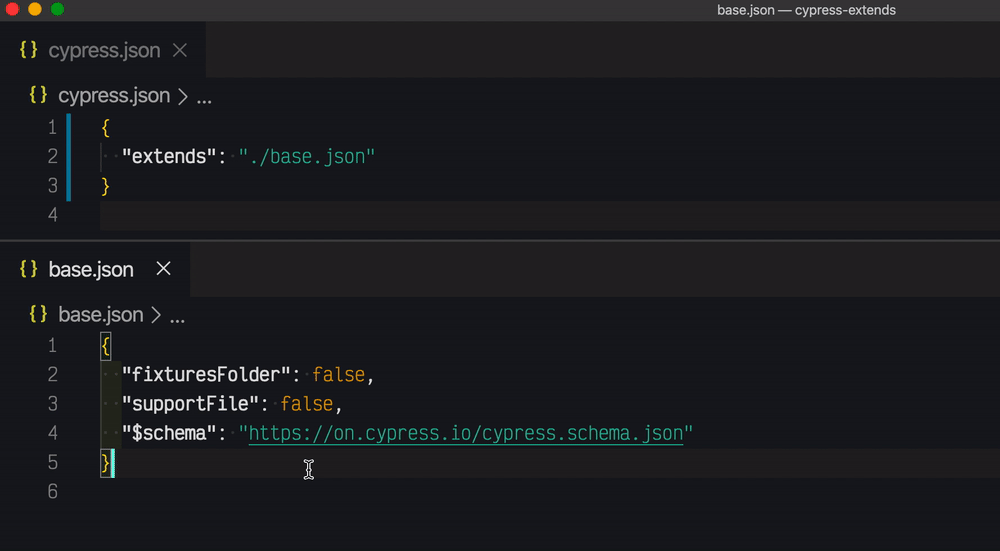

# @bahmutov/cypress-extends [![renovate-app badge][renovate-badge]][renovate-app] [![ci status][ci image]][ci url] [![badges status][badges image]][badges url] 
> Cypress plugin that adds "extends" support to the configuration file. This allows the config files to remain DRY and avoid duplicating data, but still have multiple files for different scenarios. See details in [Extending the Cypress Config File](https://www.cypress.io/blog/2020/06/18/extending-the-cypress-config-file/) blog post.

## Use

```
npm i -D @bahmutov/cypress-extends
# or
yarn add -D @bahmutov/cypress-extends
```

Add this module to your `cypress/plugins/index.js` file

```js
module.exports = (on, config) => {
  // `on` is used to hook into various events Cypress emits
  // `config` is the resolved Cypress config
  return require('@bahmutov/cypress-extends')(config.configFile)
}
```

Start using `extends` syntax in your Cypress configuration file

```
// cypress.json
{
  "extends": "./base.json"
}
// base.json
{
  "fixturesFolder": false,
  "supportFile": false,
  "$schema": "https://on.cypress.io/cypress.schema.json"
}
```

**Tip:** the `$schema` property in JSON files lets modern IDE show intelligent code completion for Cypress config values.



## Debugging

Run Cypress with environment variable

```
DEBUG=@bahmutov/cypress-extends npx cypress run
# or
DEBUG=@bahmutov/cypress-extends npx cypress open
```

## More info

Read [Cypress tips and tricks](https://glebbahmutov.com/blog/cypress-tips-and-tricks/) and watch [Cypress tips](https://www.youtube.com/playlist?list=PLP9o9QNnQuAYYRpJzDNWpeuOVTwxmIxcI) videos.

### Small print

Author: Gleb Bahmutov &lt;gleb.bahmutov@gmail.com&gt; &copy; 2020

* [@bahmutov](https://twitter.com/bahmutov)
* [glebbahmutov.com](https://glebbahmutov.com)
* [blog](https://glebbahmutov.com/blog)

License: MIT - do anything with the code, but don't blame me if it does not work.

Support: if you find any problems with this module, email / tweet /
[open issue](https://github.com/bahmutov/cypress-extends/issues) on Github

## MIT License

Copyright (c) 2020 Gleb Bahmutov &lt;gleb.bahmutov@gmail.com&gt;

Permission is hereby granted, free of charge, to any person
obtaining a copy of this software and associated documentation
files (the "Software"), to deal in the Software without
restriction, including without limitation the rights to use,
copy, modify, merge, publish, distribute, sublicense, and/or sell
copies of the Software, and to permit persons to whom the
Software is furnished to do so, subject to the following
conditions:

The above copyright notice and this permission notice shall be
included in all copies or substantial portions of the Software.

THE SOFTWARE IS PROVIDED "AS IS", WITHOUT WARRANTY OF ANY KIND,
EXPRESS OR IMPLIED, INCLUDING BUT NOT LIMITED TO THE WARRANTIES
OF MERCHANTABILITY, FITNESS FOR A PARTICULAR PURPOSE AND
NONINFRINGEMENT. IN NO EVENT SHALL THE AUTHORS OR COPYRIGHT
HOLDERS BE LIABLE FOR ANY CLAIM, DAMAGES OR OTHER LIABILITY,
WHETHER IN AN ACTION OF CONTRACT, TORT OR OTHERWISE, ARISING
FROM, OUT OF OR IN CONNECTION WITH THE SOFTWARE OR THE USE OR
OTHER DEALINGS IN THE SOFTWARE.

[ci image]: https://github.com/bahmutov/cypress-extends/workflows/ci/badge.svg?branch=master
[ci url]: https://github.com/bahmutov/cypress-extends/actions
[renovate-badge]: https://img.shields.io/badge/renovate-app-blue.svg
[renovate-app]: https://renovateapp.com/
[badges image]: https://github.com/bahmutov/cypress-extends/workflows/badges/badge.svg?branch=master
[badges url]: https://github.com/bahmutov/cypress-extends/actions
